# 🚚 Proyecto SQL: Análisis de Logística – Clientes, Pagos y Eficiencia Operativa

## 📌 Resumen (Overview)

El área de **Logística y Administración** busca optimizar la gestión de envíos, mejorar la eficiencia en la facturación y entender mejor el comportamiento de clientes y empleados.  
Mi objetivo es utilizar **SQL en SQL Server Management Studio (SSMS)** para realizar un **Exploratory Data Analysis (EDA)** sobre la base de datos **BD_Logistics**, generando insights que apoyen la toma de decisiones estratégicas en clientes, pagos, envíos y desempeño de empleados.

---

## 📂 Estructura del Proyecto

- [Sobre los Datos](#sobre-los-datos)  
- [Limpieza y Validación](#limpieza-y-validación)  
- [Preguntas de Negocio y EDA](#preguntas-de-negocio-y-eda)  
- [Conclusiones](#conclusiones)

---

## 📊 Sobre los Datos

La base de datos **BD_Logistics** contiene información integrada de clientes, empleados, membresías, pagos y envíos.  
Las principales tablas son:

- **Customer** → datos de clientes y su relación con membresías.  
- **Membership** → fechas de inicio y fin de membresías.  
- **Payment_Details** → transacciones de pago, estado y método.  
- **Shipment_Details** → información de envíos, tipo de servicio, peso y costos.  
- **Status_L** → estado actual de los envíos y fechas de envío/entrega.  
- **Employee_Details** y **Employee_Manages_Shipment** → datos de empleados y su participación en la gestión de envíos.

Los datos originales, junto con una explicación de cada columna, se pueden encontrar [aquí](https://www.kaggle.com/datasets/aashokaacharya/logistics-company-dataset-for-sql/data).


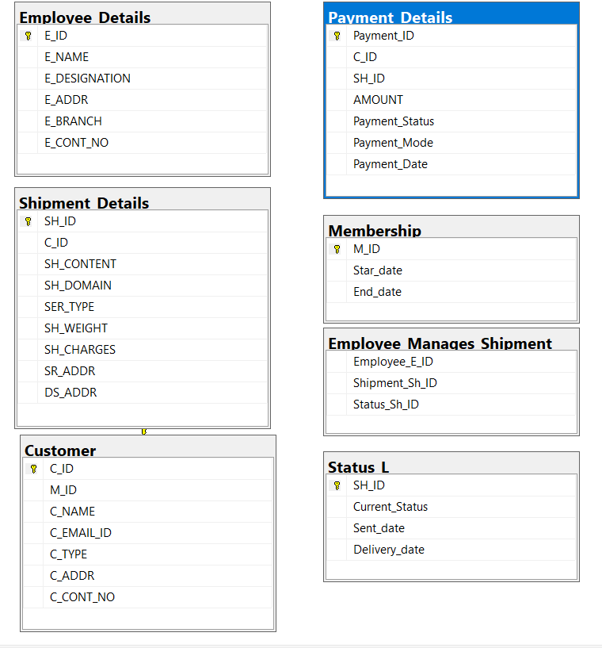

---

## 🧹 Limpieza y Validación

Antes del análisis, se verificó la calidad de los datos:

- **Duplicados**: se revisaron claves primarias (`C_ID`, `E_ID`, `Payment_ID`, `SH_ID`) y no se encontraron duplicados.  
- **Valores faltantes**: se validaron campos críticos (`C_ID`, `Payment_ID`, `SH_ID`) y se identificaron posibles nulos en fechas de entrega (`Delivery_date`), lo cual es esperado en envíos no completados.  
- **Integridad relacional**: las tablas están correctamente vinculadas por claves foráneas (ej. `C_ID`, `M_ID`, `SH_ID`).

#### Valores Nulos o Faltantes

```sql
--------------------
--Verificando datos faltantes
--------------------
 
-- TABLA Customer
SELECT COUNT(*) 
FROM CUSTOMER
WHERE C_ID IS NULL 
    OR M_ID IS NULL;

-- TABLA Employee_Details
SELECT COUNT(*)
FROM Employee_Details
WHERE E_ID IS NULL;

-- TABLA Payment_Details
SELECT COUNT(*)
FROM Payment_Details
WHERE Payment_ID IS NULL
    OR C_ID IS NULL
    OR SH_ID IS NULL;

-- TABLA Shipment_Details
SELECT  COUNT(*)
FROM Shipment_Details 
WHERE SH_ID IS NULL
    OR C_ID IS NULL;

```

A continuación, es vital asegurarse de que se eliminen las filas duplicadas, en caso de encontrarse, nuevamente en los campos clave. No se encontraron duplicados.

```sql
-------------
--Verificación de duplicados
-------------
-- TABLA Customer
SELECT C_ID ,COUNT(*) 
FROM CUSTOMER
GROUP BY C_ID 
HAVING COUNT(*)>1;

-- TABLA Employee_Details
SELECT E_ID,COUNT(*)
FROM Employee_Details
GROUP BY E_ID
HAVING COUNT(*)>1;

-- TABLA Payment_Details
SELECT Payment_ID ,COUNT(*)
FROM Payment_Details
GROUP BY Payment_ID
HAVING COUNT(*) > 1;

-- TABLA Shipment_Details
SELECT  SH_ID,COUNT(*)
FROM Shipment_Details 
GROUP BY SH_ID
HAVING COUNT(*)>1;
```

---

## 🔎 Preguntas de Negocio y EDA

Durante el análisis exploratorio se respondieron 15 preguntas clave:

1. **Distribución de clientes por categoría**  

```sql
-- 1 ¿Cómo se distribuyen los clientes entre las distintas categorías y cuál concentra la mayor participación?
SELECT C_TYPE , COUNT(*) AS CANTIDAD_CLIENTES
FROM CUSTOMER
GROUP BY C_TYPE
ORDER BY CANTIDAD_CLIENTES DESC;
```
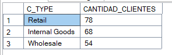

La categoría con mayor número de clientes concentra la mayor participación del negocio. Esto permite identificar el segmento más relevante para estrategias de marketing y fidelización

2. **Ingresos efectivos (PAID) y proporción frente al total**  

```sql
-- 2 -  ¿Cuál es el monto total realmente convertido en ingresos, considerando únicamente los pagos con
        -- estado PAID, y qué proporción representa frente al total de transacciones?

SELECT 
    SUM(CASE WHEN Payment_Status = 'PAID' THEN Amount ELSE 0 END) AS MontoTotalPaid,
    CAST(SUM(CASE WHEN Payment_Status = 'PAID' THEN 1 ELSE 0 END) * 100.0 / COUNT(*) AS DECIMAL(5,2)) AS PorcentajePagosCompletados
FROM Payment_Details;
```
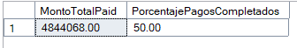

El monto total pagado refleja los ingresos efectivos. El porcentaje frente al total de transacciones muestra la eficiencia en la conversión de pagos


3. **Volumen de envíos internacionales y su impacto**  

```sql
-- 3 ¿Qué volumen de envíos corresponde al dominio internacional y cómo impacta en la estrategia logística global?

SELECT COUNT(*) AS CANTIDAD_ENVIO_INTERNACIONAL
FROM SHIPMENT_DETAILS
WHERE SH_DOMAIN = 'International';
```
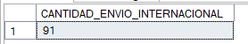


El volumen internacional indica el alcance global de la empresa y ayuda a evaluar costos logísticos internacionales.

4. **Distribución de empleados por designación**  

```sql
-- 4 - ¿Cómo se distribuyen los empleados por designación y qué áreas concentran mayor carga operativa?

SELECT E_DESIGNATION,COUNT(*) CANTIDAD_DESIGNADOS
FROM EMPLOYEE_DETAILS
GROUP BY E_DESIGNATION
ORDER BY CANTIDAD_DESIGNADOS DESC;

```
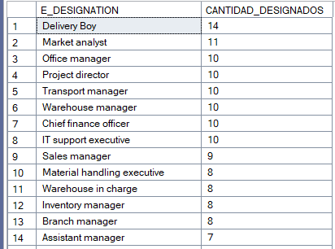

 Permite identificar qué áreas concentran mayor personal y dónde podría existir sobrecarga operativa.

5. **Peso promedio de envíos domésticos vs internacionales**  

```sql
-- 5 - ¿Existen diferencias significativas en el peso promedio de los envíos domésticos frente a los internacionales,
--    y qué porcentaje del total representan cada uno?

SELECT SH_DOMAIN,
    CAST(AVG(SH_WEIGHT) AS DECIMAL(10,2)) AS PROMEDIO_PESO,
    CAST(COUNT(*) * 100.0 / (SELECT COUNT(*) FROM SHIPMENT_DETAILS) AS DECIMAL(5,2)) AS PORCENTAJE_ENVÍOS
FROM SHIPMENT_DETAILS
GROUP BY SH_DOMAIN ;

```
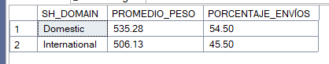

 Los envíos internacionales tienden a tener mayor peso, lo que impacta en costos y tiempos de entrega.

6. **Top 5 clientes por monto total pagado y ranking de contribución**  
   

```sql

-- 6 - ¿Quiénes son los cinco clientes con mayor monto total pagado y cómo se posicionan en términos de contribución al negocio?.

WITH Totales AS (
    SELECT 
        C.C_NAME,
        SUM(PD.AMOUNT) AS MONTO_TOTAL
    FROM CUSTOMER C
    INNER JOIN Payment_Details PD 
        ON C.C_ID = PD.C_ID
    GROUP BY C.C_NAME
)
SELECT TOP 5
    C_NAME,
    MONTO_TOTAL,
    RANK() OVER (ORDER BY MONTO_TOTAL DESC) AS RANKING_CONTRIBUCION
FROM Totales
ORDER BY MONTO_TOTAL DESC;

```
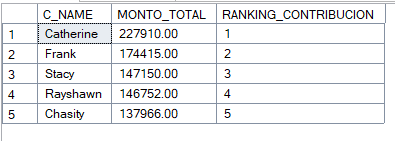

Un pequeño grupo de clientes concentra gran parte de los ingresos. Son estratégicos para programas de fidelización

7. **Duración promedio de membresías**  


```sql
-- 7 - ¿Cuál es la duración promedio (en años) de las membresías ?

SELECT CAST(AVG(DATEDIFF(DAY, STAR_DATE, END_DATE) / 365.0)AS DECIMAL(10,2)) AS DURACION_PROMEDIO
FROM MEMBERSHIP;

```
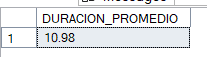

La duración promedio refleja el nivel de fidelidad de los clientes y ayuda a diseñar estrategias de retención.


8. **Porcentaje de envíos entregados vs no entregados**  
   

```sql
-- 8 - ¿Cuál es el porcentaje de envíos DELIVERED vs NOT DELIVERED en la tabla Status?

SELECT CURRENT_STATUS,
       CAST (COUNT(*) * 100.00 / (SELECT COUNT(*) FROM STATUS_L) AS DECIMAL(10,2)) AS PROCENTAJE_ENVIOS
FROM STATUS_L
GROUP BY CURRENT_STATUS;

```
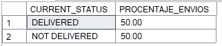

La proporción de entregas completadas mide la eficiencia operativa y la calidad del servicio.


9. **Costo promedio de envíos por servicio y tipo de cliente**  

```sql
-- 9 - ¿Cuál es el costo promedio de envíos por Tipo de servicio y por tipo de cliente?

SELECT SP.SER_TYPE,C.C_TYPE,
    CAST(AVG(SH_CHARGES) AS DECIMAL(10,2)) AS COSTO_PROMEDIO
FROM SHIPMENT_DETAILS SP JOIN CUSTOMER C
    ON SP.C_ID=C.C_ID
GROUP BY C.C_TYPE,SP.SER_TYPE
ORDER BY COSTO_PROMEDIO DESC;

```
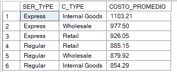

Permite identificar qué combinaciones de servicio y cliente son más rentables.

10. **Carga de trabajo de empleados en gestión de envíos**  

```sql

-- 10 - ¿Qué empleados concentran la mayor cantidad de envíos gestionados y cómo se distribuye la carga de trabajo?

SELECT E_D.E_NAME , COUNT(E_D.E_NAME)  AS CANTIDAD_ENVIOS
FROM EMPLOYEE_DETAILS E_D INNER JOIN EMPLOYEE_MANAGES_SHIPMENT E_M
ON E_D.E_ID = E_M.EMPLOYEE_E_ID
GROUP BY E_D.E_NAME
ORDER BY  CANTIDAD_ENVIOS DESC;

```

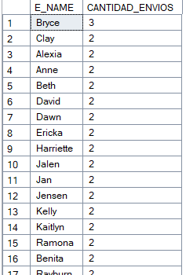

Identifica a los empleados con mayor carga operativa, útil para balancear responsabilidades.

11. **Clasificación de clientes en Bajo, Medio y Alto valor**  

```sql
-- 11 -  ¿Cómo se pueden clasificar los clientes en categorías de Bajo, Medio y Alto valor según su monto total pagado?

WITH Totales AS (
    SELECT C.C_ID,
           SUM(PD.AMOUNT) AS MONTO_TOTAL
    FROM CUSTOMER C
    INNER JOIN PAYMENT_DETAILS PD 
        ON C.C_ID = PD.C_ID
    GROUP BY C.C_ID
)
SELECT C_ID,
       MONTO_TOTAL,
       CAST (PERCENT_RANK() OVER (ORDER BY MONTO_TOTAL)AS DECIMAL(10,2)) AS RANK_RELATIVO,
       CASE
           WHEN PERCENT_RANK() OVER (ORDER BY MONTO_TOTAL) <= 0.33 THEN 'Bajo'
           WHEN PERCENT_RANK() OVER (ORDER BY MONTO_TOTAL) <= 0.66 THEN 'Medio'
           ELSE 'Alto'
       END AS CATEGORIA
FROM Totales
ORDER BY MONTO_TOTAL DESC;

```
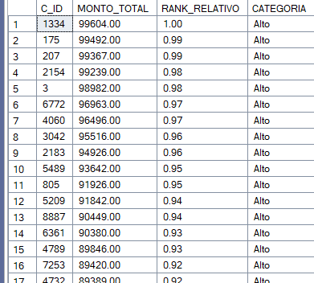

Segmenta clientes según su valor económico, permitiendo estrategias diferenciadas.

12. **Ranking relativo dentro de cada tipo de cliente (C_TYPE)**  

```sql
-- 12 -  ¿Cómo se posicionan los clientes dentro de su propia categoría (C_TYPE) en función del monto total pagado?

WITH Totales AS (
    SELECT C.C_ID,
           C.C_TYPE,
           SUM(PD.AMOUNT) AS MONTO_TOTAL
    FROM CUSTOMER C
    INNER JOIN PAYMENT_DETAILS PD 
        ON C.C_ID = PD.C_ID
    GROUP BY C.C_ID, C.C_TYPE
)
SELECT C_ID,
       C_TYPE,
       MONTO_TOTAL,
       RANK() OVER (PARTITION BY C_TYPE ORDER BY MONTO_TOTAL DESC) AS POSICION_RELATIVA
FROM Totales
ORDER BY C_TYPE, POSICION_RELATIVA;

```
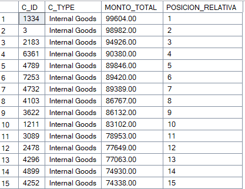

Permite comparar clientes dentro de su propio segmento.

13. **Tiempo promedio de entrega por tipo de contenido**  

```sql
-- 13 - ¿Cuál es el tiempo promedio de entrega por tipo de contenido y qué categoría demuestra mayor eficiencia logística?

WITH Tiempos AS (
    SELECT 
        SD.SH_CONTENT,
        DATEDIFF(DAY, SL.Sent_date, SL.Delivery_date) AS DIAS_ENTREGA
    FROM Shipment_Details SD
    INNER JOIN Status_L SL 
        ON SD.SH_ID = SL.SH_ID
    WHERE SL.Sent_date IS NOT NULL 
      AND SL.Delivery_date IS NOT NULL
)
SELECT 
    SH_CONTENT,
    CAST(AVG(DIAS_ENTREGA) AS DECIMAL(10,2)) AS PROMEDIO_DIAS,
    RANK() OVER (ORDER BY AVG(DIAS_ENTREGA)) AS EFICIENCIA_RANK
FROM Tiempos
GROUP BY SH_CONTENT
ORDER BY PROMEDIO_DIAS ASC;

```
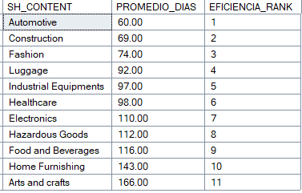

Identifica qué tipo de contenido se entrega más rápido y cuál requiere mejoras.

14. **Tasa de conversión de pagos por método de pago**  

```sql
-- 14 -  ¿Qué tan efectivos son los distintos métodos de pago en convertir transacciones en pagos completados (PAID)?


WITH Conteos AS (
    SELECT 
        Payment_Mode,
        COUNT(*) AS TotalPagos,
        SUM(CASE WHEN Payment_Status = 'PAID' THEN 1 ELSE 0 END) AS PagosExitosos
    FROM Payment_Details
    GROUP BY Payment_Mode
)
SELECT 
    Payment_Mode,
    TotalPagos,
    PagosExitosos,
    CAST( (PagosExitosos * 1.0 / TotalPagos) * 100 AS DECIMAL(5,2)) AS TasaConversion_Pct
FROM Conteos
ORDER BY TasaConversion_Pct DESC;

```
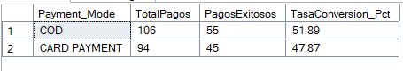

Muestra qué métodos de pago son más confiables y efectivos

15. **Compromiso de clientes con membresía en los últimos 20 años**


```sql
-- 15 -  ¿Qué porcentaje de clientes con membresía vigente ha realizado al menos un pago en los últimos 20 años, y qué nos dice esto sobre su nivel de compromiso?

WITH ClientesActivos AS (
    SELECT C.C_ID
    FROM Customer C
    INNER JOIN Membership M ON C.M_ID = M.M_ID
    WHERE M.End_date >= GETDATE()   -- Membresía vigente
),
PagosUltimos20Anios AS (
    SELECT DISTINCT C.C_ID
    FROM Customer C
    INNER JOIN Membership M ON C.M_ID = M.M_ID
    INNER JOIN Payment_Details PD ON C.C_ID = PD.C_ID
    WHERE M.End_date >= GETDATE()   -- Membresía vigente
      AND PD.Payment_Date >= DATEADD(YEAR, -20, GETDATE())
)
SELECT 
    CAST( (COUNT(DISTINCT P.C_ID) * 1.0 / COUNT(DISTINCT A.C_ID)) * 100 AS DECIMAL(5,2)) AS PorcentajeConversion
FROM ClientesActivos A
LEFT JOIN PagosUltimos20Anios P 
    ON A.C_ID = P.C_ID;

```
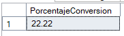

Solo alrededor del 22% de los clientes con membresía vigente han realizado al menos un pago en los últimos 20 años. Esto refleja un nivel de compromiso bajo en términos de actividad financiera. La empresa debería analizar estrategias para incentivar pagos recurrentes, como beneficios exclusivos, descuentos o programas de fidelización, con el fin de aumentar la participación de clientes con membresía activa.

---

## ✅ Conclusiones

El análisis permitió identificar insights clave para la gestión logística y administrativa:

- **Clientes estratégicos**: un pequeño grupo concentra gran parte de los ingresos, lo que sugiere programas de fidelización.  
- **Pagos y conversión**: algunos métodos de pago son más confiables que otros, orientando decisiones sobre canales preferidos.  
- **Eficiencia logística**: los envíos internacionales tienden a tener mayor peso y tiempos de entrega más largos, impactando en costos.  
- **Empleados y carga operativa**: ciertos empleados gestionan más envíos, lo que puede requerir balancear responsabilidades.  
- **Membresías y compromiso**: la duración promedio y la actividad de clientes con membresía reflejan niveles de fidelidad que deben aprovecharse.  


---

📊 **Hallazgo global:**  
Este proyecto demuestra cómo el análisis de datos con **SQL** puede transformar información dispersa en **decisiones estratégicas**, ofreciendo una base sólida para mejorar la eficiencia operativa, optimizar la experiencia del cliente y fortalecer la estrategia de negocio.
---
